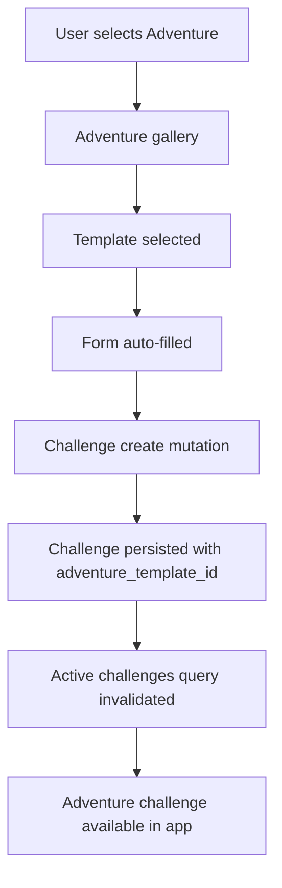
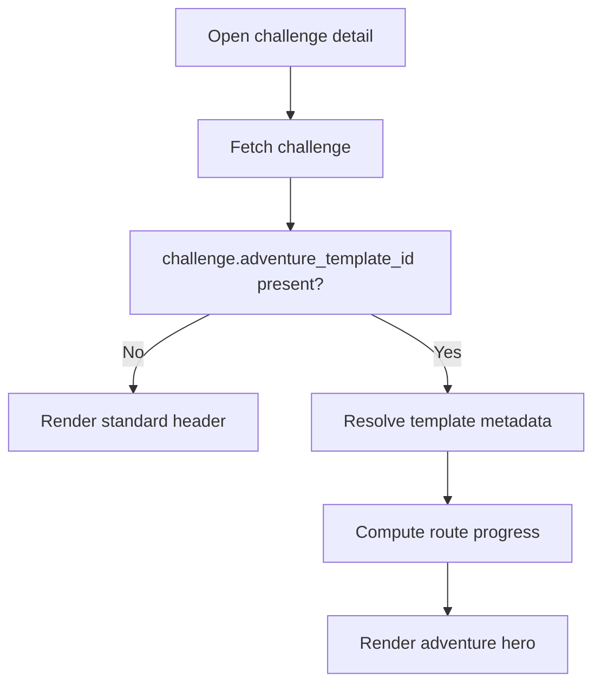
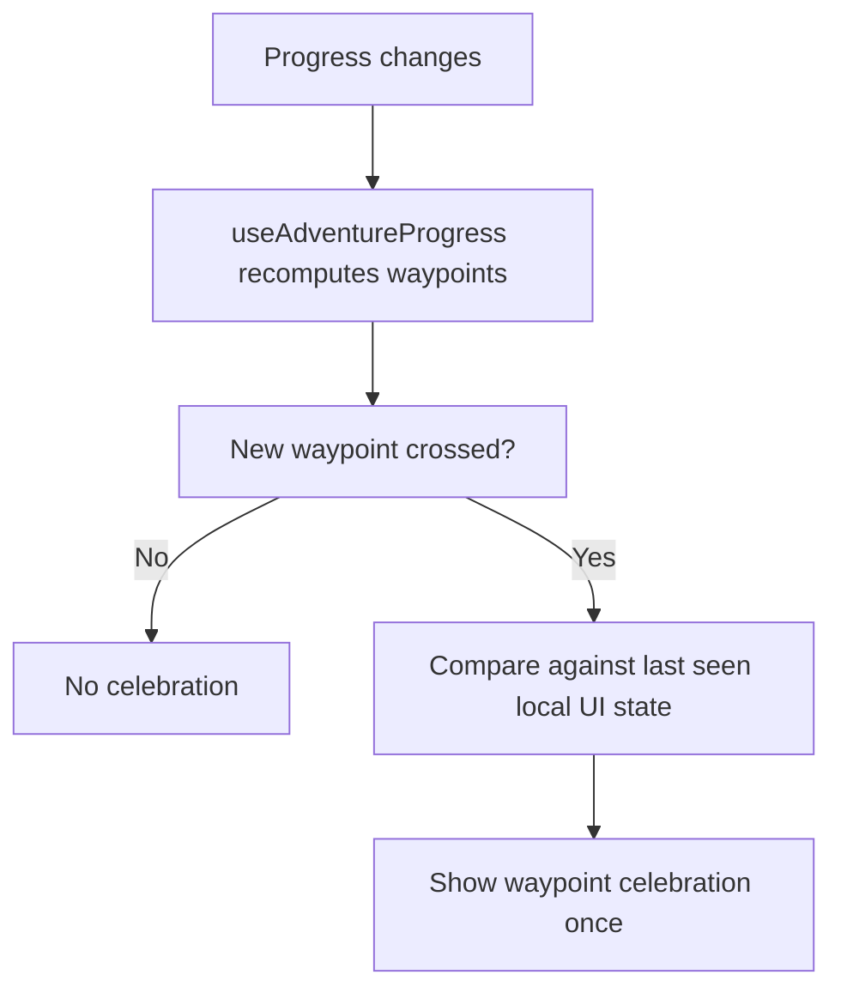

# Narrative Adventures Production Specification

> Status: Proposed  
> Audience: Product, engineering, QA, and implementation agents  
> Scope: Production-grade addition to the AVVIO application  
> Related: `docs/narrative-adventures-implementation-plan.md`
>
> Note: For active engineering implementation, use `docs/architecture/narrative-adventures-technical-design.md` as the primary technical reference. This document remains useful as supporting architecture context.

## 1. Document Intent

This document defines the full production specification for AVVIO's `Narrative Adventures` feature.

It is intentionally broader and more detailed than the initial implementation plan. It covers:

- why the feature exists
- what the feature includes
- what the feature explicitly excludes
- current-state architecture
- target-state architecture
- future-state expansion path
- backend and client implementation details
- rollout, testing, observability, and operational requirements

This should be treated as the canonical engineering spec for the feature until replaced by an ADR or shipped implementation docs.

---

## 2. Problem Statement

AVVIO's current challenge system is structurally solid but not yet visually or emotionally distinctive enough to serve as a strong market differentiator.

Current product strengths:

- social challenges
- streaks
- XP
- HealthKit sync
- challenge detail and leaderboard flows

Current product weakness:

- progress is mostly represented as numbers, bars, and rankings
- screenshots are competent but not especially memorable
- the emotional loop is weaker than the mechanical loop

### Core opportunity

Transform routine activity accumulation into a visible, story-shaped journey.

Instead of:

- "You walked 12.3 km"

The product becomes:

- "You reached the next landmark on Hadrian's Wall"

That creates a more marketable loop:

- activity becomes progress
- progress becomes place
- place becomes story
- story becomes something worth sharing

---

## 3. Product Thesis

### Primary bet

`Narrative Adventures` are the differentiation layer.

### Secondary bet

`Badges` are a supporting retention and sharing mechanic, not the core feature.

### Core message

> Turn your steps into epic journeys.

### Later expansion message

> Earn proof you were there.

### Important framing

AVVIO is not inventing a new market category. Virtual route challenges already exist. The feature is still worth pursuing because it creates meaningful differentiation relative to AVVIO's direct comparison set and fits the current architecture with manageable extension cost.

---

## 4. Current State

This section describes the current product and technical baseline as it exists today.

## 4.1 Current product state

AVVIO currently supports:

- standard challenge creation
- solo and social modes
- fixed challenge types such as `steps`, `distance`, `workouts`, `active_minutes`, `custom`, and `calories`
- challenge detail screen with hero header, activity logging, leaderboard, and info sections
- profile screen with basic stats
- existing achievements storage at the database level, but no mature badge-definition product surface

## 4.2 Current create flow state

Current challenge creation flow:

- `mode`
- `type`
- optional `workoutPicker`
- `details`
- optional `invite`
- `review`
- `success`

Relevant files:

- `src/components/create-challenge/types.ts`
- `src/components/create-challenge/CreateChallengeOrchestrator.tsx`
- `src/components/create-challenge/StepType.tsx`
- `src/components/create-challenge/StepDetails.tsx`
- `src/components/create-challenge/StepReview.tsx`

Current implication:

- there is no concept of a route template or preset-driven adventure flow
- challenge creation is activity-first, not destination-first

## 4.3 Current challenge data model state

Challenge identity is currently driven by:

- `challenge_type`
- goal values
- time window
- participants

Relevant files:

- `src/lib/validation.ts`
- `src/services/challenges.ts`
- `src/hooks/useChallenges.ts`
- `src/types/database.ts`

Current implication:

- challenge rendering assumes all information needed for display comes from the core challenge model
- introducing a local-only adventure identity would break this model

## 4.4 Current challenge detail state

The challenge detail screen already uses a strong orchestrator pattern. It computes first-class concerns once and threads them down into subcomponents.

Relevant files:

- `src/components/challenge-detail/ChallengeDetailScreen.tsx`
- `src/components/challenge-detail/types.ts`
- `src/components/challenge-detail/HeaderCard.tsx`

Current implication:

- adventure rendering can be added cleanly by swapping the hero/header region
- the rest of the detail surface can remain stable

## 4.5 Current profile and achievements state

Current profile is intentionally lightweight.

Relevant file:

- `app/(tabs)/profile.tsx`

Current achievements storage is simple:

- database table stores `user_id`, `achievement_type`, `unlocked_at`
- no metadata model
- no rarity
- no criteria engine
- no user-facing badge platform

Relevant files:

- `supabase/migrations/20240101000001_initial_schema.sql`
- `src/types/database.ts`

Current implication:

- adventure badge unlocks can reuse existing storage
- a full badge product should not be bundled into the first adventure release

## 4.6 Current feature flag state

AVVIO already has a feature flag pattern using AsyncStorage-backed toggles.

Relevant file:

- `docs/architecture/feature-flags.md`

Current implication:

- Narrative Adventures should ship behind a feature flag during development and early rollout
- AsyncStorage can be used for local feature gating or UI dismissal state
- AsyncStorage must not be used as the source of truth for adventure identity

## 4.7 Current dependency state

Present:

- `react-native-svg`

Not yet confirmed in codebase as dependencies for this feature:

- `react-native-view-shot`
- `expo-sharing`

Current implication:

- route visualization can be implemented immediately
- sharing requires explicit dependency additions

---

## 5. Target State

This section defines the intended first production state after the initial Narrative Adventures rollout.

## 5.1 User-facing target state

The user should be able to:

1. choose an Adventure during challenge creation
2. pick from a small curated set of iconic journeys
3. create a solo or social adventure challenge
4. see route progress rendered as a stylized journey on the detail screen
5. unlock waypoint celebrations as progress crosses route milestones
6. complete the journey and receive a route-specific completion state
7. share progress with a visually distinct card

## 5.2 Technical target state

The system should:

- persist adventure identity on the challenge record
- use a server-backed adventure template model
- reuse existing challenge creation and detail pipelines
- avoid introducing a second parallel challenge system
- support safe fallback rendering for non-adventure challenges
- keep badge scope intentionally narrow in the first pass

## 5.3 First release target

The first production release should ship:

- one route-based adventure template, preferably `Hadrian's Wall`
- distance-only adventure tracking
- creation flow integration
- detail hero route rendering
- waypoint progression logic
- waypoint celebration modal
- completion celebration
- one shareable card

---

## 6. Future State

This section defines the intended expansion path after the initial production release.

## 6.1 Phase B future state

After the core adventure slice proves stable and useful, AVVIO may add:

- waypoint badge unlocks
- completion badge unlocks
- compact profile showcase for adventure unlocks

## 6.2 Phase C future state

If adoption and engagement justify expansion, AVVIO may later add:

- more adventures
- seasonal adventures
- region-based adventure catalogs
- meta-badges across multiple completed adventures
- push notifications for waypoint milestones
- generalized badge metadata and rarity
- content management through server-managed template catalogs

## 6.3 Explicit future-state note

The future-state roadmap must not distort the first release architecture. The initial slice should remain lean even if the broader vision is larger.

---

## 7. Goals and Non-Goals

## 7.1 Goals

- create a visually distinct flagship challenge mode
- preserve current challenge architecture rather than replacing it
- make progress feel emotional and shareable
- keep the first rollout operationally safe
- avoid temporary shortcuts that become permanent debt

## 7.2 Non-goals for the first release

- a generalized badge economy
- rarity and percentile ownership
- social badges
- streak badges
- lifetime milestone badges
- map SDK or real geospatial mapping
- full profile redesign
- home feed redesign around adventures
- multi-mode adventures using steps, climbs, and hybrids
- seasonal adventure merchandising

---

## 8. Architecture Principles

The feature must follow these principles.

## 8.1 Adventure is not a new base logging type

Adventure is a template and presentation layer over existing challenge mechanics.

Why:

- current logging and validation pipelines already depend on the existing `challenge_type` enum
- introducing a new `challenge_type` would create broad cross-cutting changes
- the user is still ultimately logging distance for the first release

Rule:

- first release adventures use `challenge_type = distance`

## 8.2 Challenge identity remains server-owned

Adventure identity must live on the challenge record.

Why:

- challenge detail rendering needs deterministic data
- invited participants must see the same route
- reinstall and multi-device behavior must remain correct
- server queries must return enough state to drive the UI

Rule:

- do not use AsyncStorage to determine which adventure a challenge belongs to

## 8.3 Extend existing pipelines instead of forking new ones

Why:

- challenge creation, fetching, mutation, and invalidation are already established
- parallel systems create drift, duplicate logic, and future maintenance risk

Rule:

- extend `challengeService.create`
- extend `get_my_challenges` and `getChallenge`
- extend existing hooks and types

## 8.4 Template data should be first-class

Why:

- stable IDs matter for persistence
- future content operations will need a server-backed catalog
- early shortcuts around identity create expensive migration work

Rule:

- use stable template IDs now
- model templates as first-class entities even if early content is seeded

---

## 9. Domain Model

## 9.1 Current domain model

Today:

- `challenge` is the top-level unit
- `challenge_type` defines the measurement semantics
- `challenge_participants.current_progress` stores progress
- `achievements` stores unlocked achievement instances with no display metadata

## 9.2 Target domain model

New entities:

- `adventure_template`
- `adventure_waypoint`

Extended entity:

- `challenge.adventure_template_id`

Meaning:

- a challenge may optionally be linked to an adventure template
- if linked, that challenge renders with adventure UI and route semantics
- participant progress is still read from the existing challenge progress model

## 9.3 Future domain model

Possible later additions:

- server-managed badge metadata
- template availability windows
- seasonal featured content
- server-side waypoint unlock tracking

---

## 10. Data Model Specification

## 10.1 New table: `adventure_templates`

Purpose:

- canonical template identity
- stable route metadata
- server-managed enablement

Suggested schema:

```sql
create table public.adventure_templates (
  id text primary key,
  name text not null,
  subtitle text not null,
  region text not null,
  tracking_type text not null check (tracking_type in ('distance')),
  total_distance numeric not null check (total_distance > 0),
  difficulty text not null check (difficulty in ('easy', 'moderate', 'challenging', 'epic')),
  estimated_days integer not null check (estimated_days > 0),
  accent_color text not null,
  cover_image_key text null,
  completion_badge_key text null,
  is_active boolean not null default true,
  created_at timestamptz not null default now(),
  updated_at timestamptz not null default now()
);
```

Recommended indexes:

```sql
create index idx_adventure_templates_active on public.adventure_templates(is_active);
```

## 10.2 New table: `adventure_waypoints`

Purpose:

- ordered milestone definition for each route
- route-specific celebration content

Suggested schema:

```sql
create table public.adventure_waypoints (
  id text primary key,
  adventure_template_id text not null references public.adventure_templates(id) on delete cascade,
  title text not null,
  description text not null,
  distance_from_start numeric not null check (distance_from_start >= 0),
  sort_order integer not null,
  badge_key text null,
  fun_fact text null,
  created_at timestamptz not null default now(),
  updated_at timestamptz not null default now(),
  unique (adventure_template_id, sort_order)
);
```

Recommended indexes:

```sql
create index idx_adventure_waypoints_template on public.adventure_waypoints(adventure_template_id);
```

## 10.3 Change table: `challenges`

Suggested change:

```sql
alter table public.challenges
add column adventure_template_id text null
references public.adventure_templates(id);
```

Meaning:

- any challenge may optionally reference a template
- non-adventure challenges keep `null`

## 10.4 Constraints

Recommended application rule:

- if `adventure_template_id` is not null, then `challenge_type` must match the template's `tracking_type`

For the first release:

- template `tracking_type` is only `distance`
- adventure-linked challenges therefore must be `distance`

This can be enforced in the service layer first, then moved into stricter server-side logic later if needed.

---

## 11. RLS and Security

## 11.1 `adventure_templates`

Recommended policy:

- authenticated users can read active templates
- writes remain admin-only or migration-only

## 11.2 `adventure_waypoints`

Recommended policy:

- authenticated users can read waypoints for active templates
- writes remain admin-only or migration-only

## 11.3 `challenges`

Existing challenge RLS remains authoritative.

Important:

- `adventure_template_id` should not weaken challenge visibility
- reading a challenge still depends on existing participant/creator access rules

## 11.4 Security principle

Adventure data is public catalog data. Challenge participation and progress remain protected by challenge access rules.

---

## 12. RPC and Query Changes

## 12.1 `get_my_challenges`

Must be extended to return:

- `adventure_template_id`

Reason:

- active challenge cards and navigation surfaces must preserve template identity

## 12.2 `getChallenge`

Current detail query must select:

- `adventure_template_id`

This likely happens naturally via `select('*')` on `challenges`, but downstream TypeScript and service mapping must explicitly support it.

## 12.3 Future RPC options

Potential later additions:

- `get_adventure_templates`
- `get_adventure_template_detail`

These are not required for the first release if templates are seeded and read via standard table queries.

---

## 13. Validation and Service-Layer Changes

## 13.1 Validation changes

Extend `createChallengeSchema` to accept:

```ts
adventure_template_id?: string;
```

Additional refine rules:

- if `adventure_template_id` exists, `challenge_type` must be `distance`
- if `adventure_template_id` exists, `goal_unit` must be compatible with the selected template

## 13.2 Service changes

Extend:

- `challengeService.create`
- `ChallengeWithParticipation`
- challenge RPC mapping

Service responsibilities:

- validate input shape
- pass `adventure_template_id` to the underlying create RPC or insert path
- map returned challenge data including the new column

## 13.3 Query invalidation

No special invalidation model should be introduced.

Existing challenge invalidation paths should remain the source of truth:

- active challenges refresh
- detail queries refetch
- leaderboard behavior remains unchanged

---

## 14. Client Architecture

## 14.1 Source-of-truth model

Canonical identity ownership:

- database owns which template a challenge belongs to
- client resolves template presentation data using that ID

## 14.2 Template metadata strategy

Recommended short-term approach:

- keep stable template IDs in the database
- keep presentation metadata mirrored in `src/constants/adventures.ts`
- seed the same IDs in the database via migration or controlled seed script

This is acceptable temporarily because:

- the catalog is tiny
- the first release uses one or two templates
- client display work can move faster than building a complete content API

Longer-term direction:

- move full template rendering data to server-managed content or table queries

## 14.3 Feature flag

Recommended:

- add a dedicated local feature flag for adventures during development and staged rollout

Use cases:

- hide new create-flow entry points
- disable adventure rendering quickly if a production issue is discovered

Important:

- this flag gates exposure
- it does not own persistent state

---

## 15. UX and Interaction Model

## 15.1 Creation flow

Updated flow:

- `mode`
- `type`
- optional `adventure`
- optional `workoutPicker`
- `details`
- optional `invite`
- `review`
- `success`

Adventure-specific behavior:

- the user selects Adventure from `StepType`
- the user chooses a route template from the gallery
- the flow auto-fills key values
- the details step remains editable

Important:

- adventure behaves as a curated preset, not as a new primitive challenge type

## 15.2 Challenge detail

Adventure challenges should:

- swap the standard hero/header area
- render a stylized route
- show marker progress
- show reached and upcoming waypoints

The rest of the detail surface should remain mostly unchanged:

- leaderboard
- activity logging
- challenge info
- recent activity

## 15.3 Celebration UX

Waypoint celebration:

- appears when the user newly crosses a waypoint threshold
- includes title, description, optional fun fact, and share CTA

Completion celebration:

- appears when route progress reaches or exceeds total distance
- includes route completion messaging and optional completion badge reference

## 15.4 Sharing UX

First release share target:

- one square progress card

Reason:

- simplest output
- easiest to test
- enough for early social proof

---

## 16. State and Data Flow

## 16.1 Adventure creation flow



## 16.2 Adventure detail read flow



## 16.3 Waypoint celebration flow



---

## 17. File-by-File Implementation Plan

## 17.1 Schema and generated types

Files:

- `supabase/migrations/<timestamp>_adventure_templates.sql`
- `src/types/database.ts`
- `src/types/database-helpers.ts`

Tasks:

- create `adventure_templates`
- create `adventure_waypoints`
- add `challenges.adventure_template_id`
- regenerate Supabase types
- expose helper aliases if needed

## 17.2 Validation and services

Files:

- `src/lib/validation.ts`
- `src/services/challenges.ts`
- `src/hooks/useChallenges.ts`

Tasks:

- extend create schema
- pass `adventure_template_id`
- update challenge response validation
- update `ChallengeWithParticipation`

## 17.3 Adventure constants and metadata

Files:

- `src/constants/adventures.ts`

Tasks:

- define template interfaces
- define starter template metadata
- export lookup helpers

## 17.4 Create flow

Files to change:

- `src/components/create-challenge/types.ts`
- `src/components/create-challenge/CreateChallengeOrchestrator.tsx`
- `src/components/create-challenge/StepType.tsx`
- `src/components/create-challenge/StepDetails.tsx`
- `src/components/create-challenge/StepReview.tsx`

Files to add:

- `src/components/create-challenge/StepAdventureGallery.tsx`
- `src/components/create-challenge/AdventurePreviewCard.tsx`

Tasks:

- add adventure step
- extend form state
- add Adventure selection card
- route Adventure users to gallery
- auto-fill form values
- render adventure summary on review

## 17.5 Challenge detail

Files to change:

- `src/components/challenge-detail/ChallengeDetailScreen.tsx`
- `src/components/challenge-detail/types.ts`

Files to add:

- `src/components/adventure/AdventureHeaderCard.tsx`
- `src/components/adventure/RouteProgressMap.tsx`
- `src/components/adventure/WaypointMarker.tsx`
- `src/components/adventure/ParticipantMarker.tsx`

Tasks:

- detect adventure challenge
- resolve template metadata
- swap hero/header rendering
- render route progress

## 17.6 Progress computation

Files:

- `src/hooks/useAdventureProgress.ts`

Tasks:

- compute route completion percent
- determine reached waypoints
- determine next waypoint
- detect newly reached waypoint for UI

## 17.7 Celebrations

Files:

- `src/components/adventure/WaypointReachedModal.tsx`
- `src/components/adventure/AdventureCompleteModal.tsx`

Tasks:

- render waypoint unlock state
- render completion state
- expose share CTA

## 17.8 Sharing

Files:

- `src/components/adventure/ShareCard.tsx`
- `src/hooks/useShareAdventure.ts`

Tasks:

- capture card
- share image
- handle failure states gracefully

## 17.9 Phase B badge layer

Files:

- `src/constants/badges.ts`
- `src/hooks/useAdventureBadges.ts`
- optionally `app/(tabs)/profile.tsx`

Tasks:

- define adventure badge metadata only
- map unlock keys to existing `achievements`
- show simple badge surface later

---

## 18. Badge Strategy

## 18.1 First badge pass

Allowed badge scope:

- waypoint badge
- completion badge

Storage:

- use the existing `achievements` table

Examples:

- `adventure.hadrians-wall.waypoint.chesters`
- `adventure.hadrians-wall.complete`

## 18.2 What is deferred

Deferred badge work:

- rarity
- leaderboards based on badges
- social unlocks
- streak unlocks
- lifetime milestone unlocks
- generalized `useBadges` infrastructure

## 18.3 Why defer

Because those capabilities require a separate system design:

- richer badge metadata ownership
- more event triggers
- stronger criteria evaluation
- more product surface area

They should not block the first adventure release.

---

## 19. Performance Requirements

## 19.1 Rendering

Requirements:

- adventure header should not significantly degrade challenge detail mount time
- SVG route rendering should remain lightweight
- avoid expensive per-frame JS calculations

Guidelines:

- precompute path coordinates per template
- memoize static template geometry where appropriate
- avoid overanimating participant markers

## 19.2 Data fetching

Requirements:

- no additional round-trips should be required to decide whether detail is an adventure challenge if `adventure_template_id` is already on the fetched challenge
- template metadata lookup should be local or cheap

## 19.3 Sharing

Requirements:

- share card generation should fail gracefully
- capture should happen only on explicit user action

---

## 20. Accessibility Requirements

The feature must meet baseline accessibility standards.

Requirements:

- adventure cards in the gallery must have descriptive labels
- route hero must expose textual progress summaries in addition to visuals
- waypoint celebration modals must be screen-reader navigable
- color alone must not indicate reached vs unreached waypoints

Recommended text alternatives:

- `% complete`
- `next waypoint`
- `distance remaining`

---

## 21. Analytics and Observability

## 21.1 Product analytics events

Recommended event set:

- `adventure_gallery_viewed`
- `adventure_template_selected`
- `adventure_challenge_created`
- `adventure_detail_viewed`
- `adventure_waypoint_reached`
- `adventure_completed`
- `adventure_share_started`
- `adventure_share_succeeded`
- `adventure_share_failed`

## 21.2 Sentry breadcrumbs and errors

Recommended breadcrumbs:

- template selected
- challenge created with `adventure_template_id`
- waypoint celebration shown
- share attempted

Recommended error capture:

- missing template metadata for persisted challenge
- invalid template/tracking mismatch
- share card capture failure

## 21.3 Operational dashboards

Recommended early monitoring:

- count of adventure challenges created
- percentage of created adventure challenges that receive progress within 7 days
- completion rate for the first adventure template
- share attempt and success rates

---

## 22. Rollout Plan

## 22.1 Development phase

- build behind a feature flag
- seed only one template
- verify end-to-end behavior locally and in simulator

## 22.2 Internal QA phase

- enable for internal testers only
- verify multi-device behavior
- verify reinstall behavior
- verify non-adventure regressions

## 22.3 Controlled production exposure

Options:

- hidden entry point
- internal/tester-only flag
- soft launch to a small cohort

## 22.4 Full production rollout

Only proceed when:

- route rendering is stable
- create flow is stable
- waypoint celebrations behave deterministically
- no challenge-detail regressions are found

---

## 23. Testing Strategy

## 23.1 Unit tests

Add tests for:

- template lookup helpers
- `useAdventureProgress`
- waypoint crossing logic
- create schema validation for `adventure_template_id`
- challenge mapping including `adventure_template_id`

## 23.2 Integration tests

Add tests for:

- create challenge service with adventure ID
- detail query mapping
- non-adventure challenge behavior unchanged

## 23.3 UI component tests

Add tests for:

- adventure gallery rendering
- route hero rendering
- waypoint modal content
- completion modal content

## 23.4 E2E tests

Add E2E coverage for:

1. create solo adventure
2. create social adventure
3. log progress and render route update
4. cross waypoint and show modal
5. complete route and show completion modal
6. verify standard challenge flows are unaffected

## 23.5 Regression suite

Must verify:

- standard challenge creation
- standard challenge detail
- social invite flows
- activity logging
- leaderboard rendering

---

## 24. Migration and Backward Compatibility

## 24.1 Existing challenges

Existing challenges remain valid with:

- `adventure_template_id = null`

No migration backfill is required.

## 24.2 Existing clients

If an older client does not understand adventures:

- it should still treat the challenge as a normal distance challenge

This is acceptable for short compatibility windows, but updated clients should be preferred as soon as the feature ships broadly.

## 24.3 Failure mode

If template metadata cannot be resolved on the client:

- render a safe fallback standard header
- log an error
- do not block access to the challenge

---

## 25. Risks and Mitigations

| Risk | Impact | Mitigation |
| --- | --- | --- |
| Feature feels cosmetic | Low adoption | Ship waypoint progression and celebration in first slice |
| AsyncStorage workaround leaks into production | Cross-device inconsistency | Persist `adventure_template_id` on server from day one |
| Badge scope expands too early | Delivery delay | Limit first badge pass to waypoint and completion unlocks only |
| Steps/climb variants muddy semantics | Product confusion | Use distance-only adventures first |
| Detail screen becomes too complex | Regression risk | Swap hero area only in first pass |
| Template metadata drifts between client and DB | Rendering issues | Use stable IDs and a controlled seed process |

---

## 26. Implementation Sequence

This is the required merge order.

## PR 1: Schema and service plumbing

Includes:

- migrations
- generated types
- service validation
- challenge response mapping
- create mutation support

Exit criteria:

- challenge can persist and refetch `adventure_template_id`

## PR 2: Adventure catalog and create flow

Includes:

- template metadata
- gallery UI
- create form integration
- review step summary

Exit criteria:

- user can create an adventure challenge end-to-end

## PR 3: Adventure detail hero

Includes:

- hero/header swap
- route visualization

Exit criteria:

- adventure challenge renders as a route journey on detail

## PR 4: Progress and celebrations

Includes:

- waypoint logic
- waypoint modal
- completion modal

Exit criteria:

- progress and celebration loop is functional

## PR 5: Sharing

Includes:

- share card
- image capture
- native share flow

Exit criteria:

- user can share progress safely

## PR 6: Adventure badge unlocks

Includes:

- badge metadata
- achievement key mapping
- optional lightweight profile display

Exit criteria:

- adventure-specific unlocks are visible and stable

---

## 27. Acceptance Criteria

The first release is complete when all of the following are true.

### Product acceptance

- user can create an adventure challenge from the standard wizard
- user sees route-specific visual progress on challenge detail
- user receives waypoint celebration at milestone crossings
- user receives completion celebration on finish
- user can share progress from an adventure challenge

### Technical acceptance

- adventure identity survives reinstall and multi-device use
- invited participants see the same adventure route
- non-adventure challenges remain unchanged
- service layer, hooks, and generated types remain coherent

### Operational acceptance

- feature can be disabled behind a flag if necessary
- key analytics and Sentry breadcrumbs exist
- tests cover the critical happy path and major regressions

---

## 28. Open Questions

These should be answered before implementation begins or during PR 1.

1. Will template presentation metadata live fully in the database immediately, or will the first release use a DB identity plus client-side metadata mirror?
2. Should adventure templates be queryable from the server in the first release, or seeded and mirrored locally for speed?
3. Will waypoint badge unlocks be client-evaluated first or server-awarded first?
4. Is a dedicated feature flag for adventures needed, or is the existing flag system sufficient with a new key?
5. Should early rollout be internal-only, or hidden but available in production builds?

---

## 29. Final Recommendation

AVVIO should implement Narrative Adventures now.

The correct production approach is:

- server-backed identity
- distance-only first release
- one polished route before many routes
- hero-level visual differentiation first
- badges later and narrowly scoped

This produces a feature that is marketable, technically coherent, and safe to add to a production application without creating avoidable debt.
