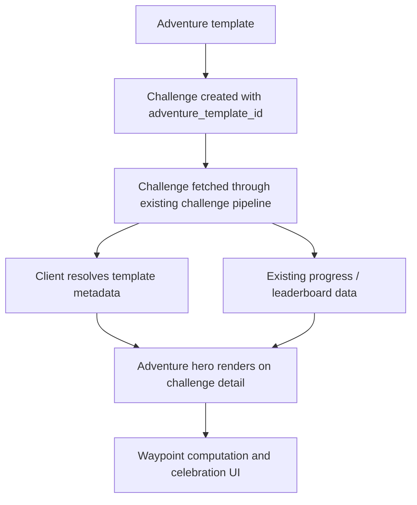
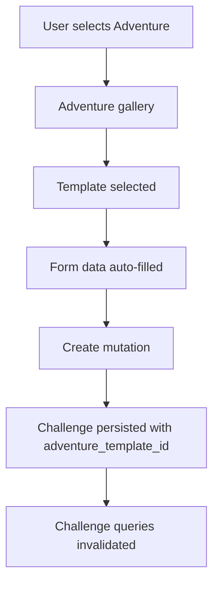
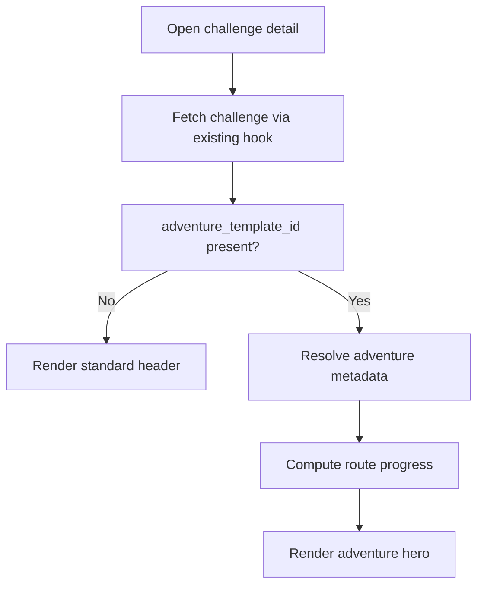
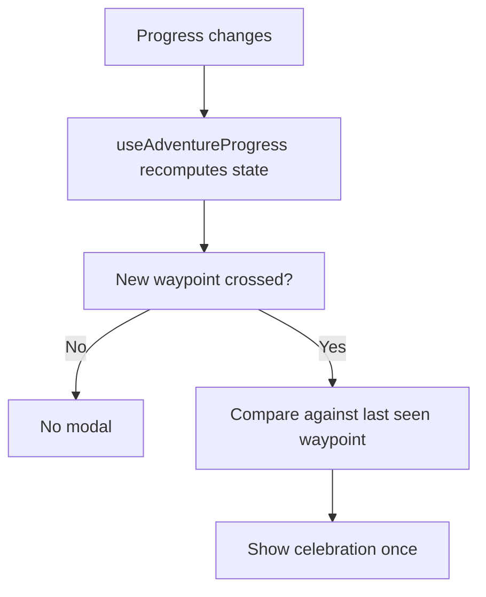

# Narrative Adventures Technical Design Spec

> Status: Draft  
> Audience: Engineering, QA, implementation agents  
> Feature: Narrative Adventures  
> Product: AVVIO  
> Companion docs:
>
> - `docs/product/narrative-adventures-prd.md`
> - `docs/narrative-adventures-implementation-plan.md`
> - `docs/architecture/narrative-adventures-production-spec.md`

## 1. Purpose

This document defines the technical design for the first production release of `Narrative Adventures`.

It translates the approved product requirements into an engineering implementation plan and should be treated as the primary technical reference for the feature during development.

This document is intended to guide decisions about:

- schema and persistence
- service, RPC, and validation changes
- client architecture and UI integration
- data flow and state ownership
- rollout constraints
- testing and verification

This document is not the product requirements document and does not replace the PRD. It also does not attempt to design the full long-term adventure platform. It is intentionally scoped to the first production release of Narrative Adventures so the team can implement a technically sound, production-ready vertical slice without absorbing unnecessary future-state complexity.

---

## 2. Technical Objectives

The first release of Narrative Adventures must extend AVVIO's existing challenge architecture cleanly, without introducing avoidable product or technical debt.

### 2.1 Required technical outcomes

The implementation must:

- add adventure support as a first-class extension of the current challenge system
- persist adventure identity on the challenge record so it survives reinstall, refetch, and multi-device use
- support one distance-based route template in the first production release
- reuse the existing challenge creation, fetch, mutation, and detail pipelines wherever possible
- preserve standard non-adventure challenge behavior unchanged
- support deterministic waypoint and completion state in the UI
- support safe production rollout behind a feature flag
- provide enough analytics and fallback behavior for a measurable and reversible release

### 2.2 Explicit technical boundaries

The first release must not:

- introduce a new backend `challenge_type`
- rely on AsyncStorage or any other device-local store as the source of truth for adventure identity
- create a separate parallel challenge system for adventures
- require generalized badge infrastructure in order to ship
- require hard activity subtype enforcement for distance adventures
- require a map SDK, geospatial engine, or real-world route rendering stack

### 2.3 Engineering standard

The goal of the first release is not only to make the feature functional. It is to make the feature production-safe, architecturally coherent, and easy to extend later without reworking the core challenge model.

---

## 3. Current Architecture Baseline

## 3.1 Create flow

Current creation is a step-based flow implemented in:

- `src/components/create-challenge/types.ts`
- `src/components/create-challenge/CreateChallengeOrchestrator.tsx`
- `src/components/create-challenge/StepType.tsx`
- `src/components/create-challenge/StepDetails.tsx`
- `src/components/create-challenge/StepReview.tsx`

Current steps:

- `mode`
- `type`
- optional `workoutPicker`
- `details`
- optional `invite`
- `review`
- `success`

## 3.2 Challenge data model

Current challenge creation and retrieval are driven through:

- `src/lib/validation.ts`
- `src/services/challenges.ts`
- `src/hooks/useChallenges.ts`
- Supabase RPCs such as `get_my_challenges`

Current model assumptions:

- `challenge_type` defines logging semantics
- challenge identity is server-owned
- detail rendering assumes the fetched challenge contains the state needed to choose the UI

## 3.3 Challenge detail

Challenge detail is already orchestrated cleanly in:

- `src/components/challenge-detail/ChallengeDetailScreen.tsx`
- `src/components/challenge-detail/types.ts`

This is important because the first adventure release should change the hero region without rewriting the rest of the screen.

## 3.4 Health and distance behavior

Distance is currently a generic challenge type. Relevant behavior lives in:

- `src/services/health/utils/dataMapper.ts`
- `src/services/health/providers/HealthKitProvider.ts`

Important first-release constraint:

- distance is normalized generically
- activity subtype enforcement for distance challenges is not currently a first-class feature

## 3.5 Achievements

AVVIO already has an `achievements` table for unlocked achievement records, but the first release of Narrative Adventures does not depend on generalized badge infrastructure.

---

## 4. Design Decisions

## 4.1 Adventure is a template layer, not a new challenge primitive

Decision:

- do not introduce a new backend `challenge_type`

Reason:

- existing logging, validation, health sync, and challenge services already assume the current enum set
- adventure is a route/presentation concept, not a new measurement primitive

First-release rule:

- adventures use `challenge_type = distance`

## 4.2 Challenge identity remains server-owned

Decision:

- persist `adventure_template_id` on `challenges`

Reason:

- challenge detail rendering must be deterministic
- invited participants must see the same route
- reinstall and multi-device behavior must remain correct

## 4.3 Templates are first-class data

Decision:

- create `adventure_templates` and `adventure_waypoints`

Reason:

- stable IDs are needed immediately
- future content expansion should not require identity migration

## 4.4 Hard activity enforcement is deferred

Decision:

- the first release may include recommended activities for a route, but not hard subtype filtering

Reason:

- distance subtype enforcement would introduce a separate feature track
- the current model does not yet support subtype-filtered distance challenges cleanly

---

## 5. Proposed Architecture

## 5.1 High-level model



## 5.2 First-release system boundaries

Server responsibilities:

- own template identity
- own challenge-to-template relationship
- return `adventure_template_id` in challenge fetches

Client responsibilities:

- render adventure selection UI
- resolve template presentation metadata
- compute route progress and waypoint UI state
- render route hero, celebrations, and sharing

Local storage responsibilities:

- only local UI state such as `lastSeenWaypoint`
- never challenge-to-template identity

---

## 6. Data Model

## 6.1 New table: `adventure_templates`

Suggested schema:

```sql
create table public.adventure_templates (
  id text primary key,
  name text not null,
  subtitle text not null,
  region text not null,
  tracking_type text not null check (tracking_type in ('distance')),
  total_distance numeric not null check (total_distance > 0),
  difficulty text not null check (difficulty in ('easy', 'moderate', 'challenging', 'epic')),
  estimated_days integer not null check (estimated_days > 0),
  accent_color text not null,
  cover_image_key text null,
  completion_badge_key text null,
  is_active boolean not null default true,
  created_at timestamptz not null default now(),
  updated_at timestamptz not null default now()
);
```

## 6.2 New table: `adventure_waypoints`

Suggested schema:

```sql
create table public.adventure_waypoints (
  id text primary key,
  adventure_template_id text not null references public.adventure_templates(id) on delete cascade,
  title text not null,
  description text not null,
  distance_from_start numeric not null check (distance_from_start >= 0),
  sort_order integer not null,
  badge_key text null,
  fun_fact text null,
  created_at timestamptz not null default now(),
  updated_at timestamptz not null default now(),
  unique (adventure_template_id, sort_order)
);
```

## 6.3 Change table: `challenges`

Suggested change:

```sql
alter table public.challenges
add column adventure_template_id text null
references public.adventure_templates(id);
```

## 6.4 First-release constraints

First-release application rules:

- if `adventure_template_id` is present, `challenge_type` must be `distance`
- templates shown in the create flow must be active
- first-release templates may define recommended activities, but those are descriptive only

---

## 7. RLS and Access Model

## 7.1 `adventure_templates`

Recommended:

- authenticated users can read active templates
- writes remain migration-only or admin-controlled

## 7.2 `adventure_waypoints`

Recommended:

- authenticated users can read waypoints for active templates
- writes remain migration-only or admin-controlled

## 7.3 `challenges`

Existing challenge RLS remains authoritative. Adding `adventure_template_id` must not change challenge visibility semantics.

---

## 8. API, RPC, and Validation Changes

## 8.1 Validation

Extend `createChallengeSchema` in `src/lib/validation.ts` with:

```ts
adventure_template_id?: string;
```

Additional validation rules:

- if `adventure_template_id` exists, `challenge_type` must be `distance`
- adventure IDs must be valid known template IDs by the time the service commits

## 8.2 Challenge create service

Extend `challengeService.create` in `src/services/challenges.ts` to accept and pass:

- `adventure_template_id`

The create path must remain the existing challenge pipeline, not a new service path.

## 8.3 Challenge fetches

The following fetch paths must expose `adventure_template_id`:

- `get_my_challenges`
- `getCompletedChallenges`
- `getChallenge`

This requires:

- response schema updates in `src/services/challenges.ts`
- `ChallengeWithParticipation` extension
- regenerated database types if RPC return shape changes

## 8.4 Candidate server-side implementation options

Option A:

- extend the existing challenge creation RPC to accept `p_adventure_template_id`

Option B:

- write to `challenges` through a direct insert path if that already exists elsewhere

Recommendation:

- extend the existing RPC

Reason:

- avoids splitting creation semantics
- preserves current atomic creation path

---

## 9. TypeScript Models

## 9.1 Adventure template types

Recommended client-side model:

```ts
export interface AdventureWaypoint {
  id: string;
  title: string;
  description: string;
  distanceFromStart: number;
  badgeKey?: string | null;
  funFact?: string | null;
}

export interface AdventureTemplate {
  id: string;
  name: string;
  subtitle: string;
  region: string;
  trackingType: "distance";
  totalDistance: number;
  difficulty: "easy" | "moderate" | "challenging" | "epic";
  estimatedDays: number;
  accentColor: string;
  coverImageKey?: string | null;
  completionBadgeKey?: string | null;
  recommendedActivities?: string[] | null;
  waypoints: AdventureWaypoint[];
}
```

## 9.2 Challenge model extension

Extend `ChallengeWithParticipation` with:

```ts
adventure_template_id?: string | null;
```

---

## 10. Client Architecture

## 10.1 Template metadata source

First-release recommendation:

- use server-backed template identity
- use client-side mirrored display metadata in `src/constants/adventures.ts`

Reason:

- reduces first-release content query complexity
- preserves stable identity
- gives a clean path to later server-managed catalog rendering

## 10.2 Adventure create flow

Files to modify:

- `src/components/create-challenge/types.ts`
- `src/components/create-challenge/CreateChallengeOrchestrator.tsx`
- `src/components/create-challenge/StepType.tsx`
- `src/components/create-challenge/StepDetails.tsx`
- `src/components/create-challenge/StepReview.tsx`

Files to add:

- `src/components/create-challenge/StepAdventureGallery.tsx`
- `src/components/create-challenge/AdventurePreviewCard.tsx`

Behavior:

- add `adventure` step
- add `adventureTemplateId` to form state
- selecting Adventure routes to gallery
- template selection auto-fills challenge config
- review step reflects the selected route

## 10.3 Challenge detail rendering

Files to modify:

- `src/components/challenge-detail/ChallengeDetailScreen.tsx`
- `src/components/challenge-detail/types.ts`

Files to add:

- `src/components/adventure/AdventureHeaderCard.tsx`
- `src/components/adventure/RouteProgressMap.tsx`
- `src/components/adventure/WaypointMarker.tsx`
- `src/components/adventure/ParticipantMarker.tsx`

Behavior:

- if `challenge.adventure_template_id` exists, resolve template metadata
- render adventure hero in place of the standard header
- keep remaining challenge detail sections unchanged in the first release

## 10.4 Progress computation

File to add:

- `src/hooks/useAdventureProgress.ts`

Responsibilities:

- compute percent complete against `template.totalDistance`
- determine reached waypoints
- determine next waypoint
- determine whether a new waypoint was crossed since last-seen UI state

## 10.5 Celebration state

Files to add:

- `src/components/adventure/WaypointReachedModal.tsx`
- `src/components/adventure/AdventureCompleteModal.tsx`

Storage note:

- AsyncStorage may be used only for local UI suppression state such as `lastSeenWaypoint`

## 10.6 Sharing

Files to add:

- `src/components/adventure/ShareCard.tsx`
- `src/hooks/useShareAdventure.ts`

Dependencies:

- `react-native-view-shot`
- `expo-sharing`

---

## 11. Detailed Data Flow

## 11.1 Create flow



## 11.2 Detail flow



## 11.3 Waypoint flow



---

## 12. Fallback and Failure Modes

## 12.1 Missing metadata

If a challenge has an `adventure_template_id` but client metadata cannot be resolved:

- log an error
- render safe fallback standard header
- do not block challenge usage

## 12.2 Share failure

If capture or native sharing fails:

- show non-fatal error feedback
- preserve challenge usability

## 12.3 Waypoint suppression corruption

If local last-seen waypoint state is missing or reset:

- do not corrupt challenge data
- allow UI to recover safely
- avoid repeated spam where possible

---

## 13. Performance Considerations

Requirements:

- hero rendering must not materially degrade detail screen load
- route drawing must remain lightweight
- progress computation must be cheap and deterministic

Guidelines:

- prefer hand-authored simple SVG paths
- do not introduce map SDKs
- avoid expensive per-frame calculations
- capture share cards only on explicit user action

---

## 14. Accessibility Requirements

The first release must include:

- accessible labels for adventure gallery items
- textual progress summaries in addition to route visuals
- non-color-only waypoint state
- accessible modal interaction for waypoint and completion states

---

## 15. Analytics and Observability

## 15.1 Analytics events

Recommended event set:

- `adventure_template_selected`
- `adventure_challenge_created`
- `adventure_detail_viewed`
- `adventure_waypoint_reached`
- `adventure_completed`
- `adventure_share_started`
- `adventure_share_succeeded`
- `adventure_share_failed`

## 15.2 Error monitoring

Recommended error capture:

- unresolved template metadata
- create request with invalid adventure linkage
- waypoint computation failures
- share capture failures

## 15.3 Breadcrumbs

Add breadcrumbs around:

- template selection
- challenge creation
- route render path
- waypoint modal shown
- share initiated

---

## 16. Feature Flag and Rollout Controls

Recommendation:

- ship behind a dedicated Narrative Adventures flag or equivalent scoped product flag

The flag must control exposure, not state ownership.

Suggested gating points:

- Adventure option in create flow
- adventure detail hero rendering
- share entry point if necessary

---

## 17. Testing Strategy

## 17.1 Unit tests

Add tests for:

- template lookup helpers
- `useAdventureProgress`
- validation rules for `adventure_template_id`
- challenge service mapping with `adventure_template_id`

## 17.2 Integration tests

Add tests for:

- create flow request shape
- fetched challenge mapping
- fallback behavior when metadata is missing
- non-adventure challenge behavior unchanged

## 17.3 E2E coverage

Minimum E2E scenarios:

1. create solo adventure
2. create social adventure
3. log progress and update route
4. cross waypoint and show celebration
5. complete route and show completion state
6. verify non-adventure regressions

## 17.4 Regression matrix

Must include:

- creator vs invitee
- solo vs social
- reinstall behavior
- multi-device behavior
- standard challenge create/detail/logging/leaderboard flows

---

## 18. Rollout and Verification

## 18.1 Development phase

- build behind feature flag
- seed one route
- verify end-to-end in simulator

## 18.2 Internal QA phase

- enable internally
- verify device consistency and regressions

## 18.3 Controlled production phase

- limited exposure
- monitor analytics and errors
- validate that the feature is understandable, not just technically correct

---

## 19. Implementation Order

Recommended order:

1. schema and service plumbing
2. create flow integration
3. adventure detail hero
4. waypoint progress and celebrations
5. sharing

Badge work is deferred from the first release core.

---

## 20. Open Technical Questions

1. Will first-release template presentation data remain mirrored client-side, or should a template fetch path be added immediately?
2. Should waypoint UI state remain entirely client-evaluated in v1, or should some server support be pulled forward?
3. Should the feature use a dedicated flag or extend the current flag framework with a more general pattern?

---

## 21. Final Recommendation

The first technical release of Narrative Adventures should be:

- server-backed
- distance-only
- one-route-first
- additive to the current challenge system
- operationally safe behind rollout controls

The main technical priority is not breadth. It is correctness, determinism, and clean integration into AVVIO's existing architecture.
